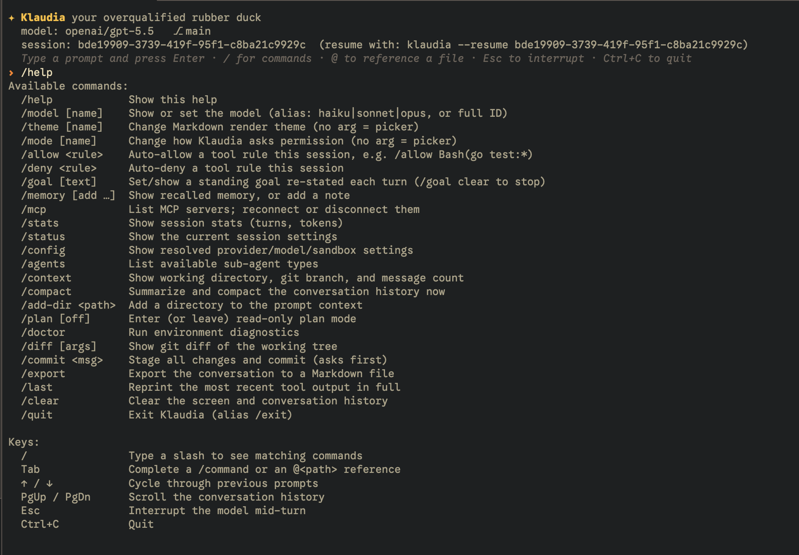

# Klaudia

A locally-buildable, extensible coding agent — a single static Go binary (Linux +
macOS), no runtime dependencies. Klaudia began as a cleanroom of Claude Code
(v2.1.66) and was ported to Go; the JavaScript reference is retired (preserved on
the `js-reference` branch). See [Background](#background) for the story and
[docs/parity.md](docs/parity.md) for the feature map.



Klaudia keeps full parity with the reference and then builds past it — the
extras we lean on day to day:

- **[Code intelligence (LSP)](#code-intelligence-lsp)** — real diagnostics and
  go-to-definition from language servers you already have installed.
- **[Memory & project knowledge](#memory--project-knowledge)** — a `MEMORY.md`
  index that links out to detail notes, recalled into every session.
- **[Themes](#themes)** — the whole UI (banner, prompts, menus, Markdown)
  recolors, persisted in config.
- **[Standing goals](#standing-goals)** — `/goal` pins an objective that's
  re-stated to the model every turn.
- Plus [OS/container Bash sandboxing](#sandboxing-the-bash-tool), local
  [web search & browsing](#web-search--browsing), [MCP](#mcp), and
  [skills](#skills).

## Getting started

### Install

```bash
go install github.com/greenthread-ai/klaudia/cmd/klaudia@main
```

This installs the `klaudia` binary into `$(go env GOPATH)/bin` (commonly
`~/go/bin`) — make sure that's on your `PATH`. We track `main` while a release
tag isn't published yet; `@main` always resolves to the current HEAD, whereas
`@latest` (the usual Go default) routes through `proxy.golang.org` and can lag
behind new commits on an untagged module. To force a refresh:
`GOPROXY=direct go install github.com/greenthread-ai/klaudia/cmd/klaudia@latest`.

Prefer to build from a checkout? See [Build](#build).

### Create a config (optional but recommended)

Klaudia reads `~/.klaudia/config.toml` automatically for every run; a project
`./.klaudia/config.toml` overlays it when present. Generate a commented starter:

```bash
klaudia --create-config=global   # ~/.klaudia/config.toml  (your default)
# or:
klaudia --create-config=local    # ./.klaudia/config.toml  (project override)
```

Both commands refuse to overwrite an existing config (so you can't accidentally
clobber settings); delete the file first if you want a fresh starter.

### Authentication

Pick one of these paths:

**Anthropic API key**

```bash
export ANTHROPIC_API_KEY="sk-ant-..."
klaudia
```

**Existing Claude Code login on macOS**

Klaudia can reuse an existing Claude Code OAuth session from the macOS Keychain.
Sign in with Claude Code first, then run Klaudia:

```bash
claude
klaudia
```

**OpenAI-compatible provider**

Edit the config you just generated and set the provider block:

```toml
# ~/.klaudia/config.toml  (comments are supported)
provider = "openai"
model = "openai/gpt-5.5"
baseURL = "https://api.example.com/v1"

# apiKeyEnv is the NAME of the environment variable that holds your key —
# pick any name you like and export a variable of that name (see below).
# Prefer this over apiKey = "sk-..." so the key stays out of the file.
apiKeyEnv = "MY_API_KEY"
```

Then export the variable you named in `apiKeyEnv` and run:

```bash
export MY_API_KEY="sk-..."   # same name as apiKeyEnv above
klaudia
```

Once the TUI starts, type `/doctor` to verify auth and environment status.

## Build

Pure Go, no CGO, no system libraries:

```bash
CGO_ENABLED=0 go build -o klaudia ./cmd/klaudia
go test ./internal/...
```

The result is one self-contained binary (Linux + macOS).

## Usage

### Interactive (TUI)

```bash
./klaudia
```

A Bubble Tea terminal UI: streamed Markdown answers, `/` slash commands with
type-ahead, `@path` file completion (Tab), input history (↑/↓), scrollback
(PgUp/PgDn), and `Esc` to interrupt a turn. Type `/help` for the full list.

Tool calls show their key input (e.g. `⚙ Bash go test ./...`) and a `-`/`+`
preview for edits; a status bar tracks model · mode · turns · tokens; and
`/last` reprints the most recent tool output in full.

You can **queue a follow-up while the model is working**: type and press Enter to
queue it (it's sent when the current turn finishes); press Enter again to
interrupt and send it now, or `↑` to edit it.

`/theme` switches the colour theme (Markdown + chrome) for the session; set a
durable default with `theme = "nord"` in `.klaudia/config.toml` (dracula |
gruvbox | tokyo-night | nord | catppuccin).

Long-running commands can run detached: `Bash` with `run_in_background` returns a
shell id, then `BashOutput` reads new output incrementally and `KillShell` stops
it — so the agent can launch a dev server or watcher and keep working. Background
shells are terminated when the session ends.

### Headless (one-shot)

```bash
# Print the final result and exit
./klaudia -p "What files are in this directory?"

# Full autonomy (skip permission prompts)
./klaudia -p "Create hello.py" --dangerously-skip-permissions

# Stream events as JSON (tool calls, results) as they happen
./klaudia -p "Explain the build" --output-format stream-json --verbose

# Partial message deltas, JS-compatible (only with --print + stream-json)
./klaudia -p "…" --output-format stream-json --verbose --include-partial-messages
```

### Embedding (stream-json over stdin)

A persistent agent driven by newline-delimited JSON over stdin/stdout — the
channel for editor/SDK integrations (no terminal needed):

```bash
./klaudia --input-format stream-json --verbose
```

### Resuming

```bash
./klaudia                            # auto-resume the most recent session here
./klaudia --new-session              # start fresh instead of auto-resuming
./klaudia --continue                 # explicitly resume the most recent session here
./klaudia -r <session-id>            # resume a specific session
./klaudia -r <session-id> --full     # replay the whole transcript (not the summary)
```

Auto-resume is an interactive convenience: headless (`-p`) and embedding
(`--input-format stream-json`) runs stay stateless unless you pass
`--continue` or `-r <id>`.

Sessions are JSONL transcripts under `~/.klaudia/sessions/<encoded-cwd>/`
(override the base with `KLAUDIA_CONFIG_DIR`). Klaudia still reads legacy
transcripts from `~/.klaudia/projects/<encoded-cwd>/` during migration. When a
session has a persisted compaction summary, resume seeds from it (token-saving)
unless `--full`.

## Permission modes

| Flag | Mode | Behavior |
|------|------|----------|
| *(default)* | `default` | Ask before risky operations (interactive only) |
| `--permission-mode acceptEdits` | `acceptEdits` | Auto-accept file edits |
| `--dangerously-skip-permissions` | `bypassPermissions` | Allow everything |
| `--permission-mode plan` | `plan` | Read-only; mutations and network blocked |
| `--permission-mode dontAsk` | `dontAsk` | Deny anything not pre-approved |

In the TUI, `/mode` switches modes interactively. Headless `-p` without
`--dangerously-skip-permissions` denies anything that would prompt (no TTY).
Session allow/deny rules: `--allowedTools 'Bash(go test:*)'`, `--disallowedTools …`,
or `/allow` / `/deny` at runtime.

## Model & provider

Klaudia defaults to the Anthropic Messages API. A project or user
`.klaudia/config.toml` selects the provider and model:

```toml
# "anthropic" (default) | "openai"
provider = "openai"
model = "openai/gpt-5.5"

# OpenAI-compatible endpoint.
baseURL = "https://api.example.com/v1"

# apiKeyEnv names the env var holding the key (you then `export MY_API_KEY=...`).
# Or set apiKey = "sk-..." inline — but the env form keeps secrets out of files.
apiKeyEnv = "MY_API_KEY"
```

Create a commented starter config with `./klaudia --create-config=global` for
`~/.klaudia/config.toml`, or `./klaudia --create-config=local` for
`./.klaudia/config.toml`.

`--model haiku|sonnet|opus` (or a full model ID) overrides per-run. The
OpenAI-compatible provider translates the Anthropic message shape to Chat
Completions (including image tool-results → `image_url`).

`~/.klaudia/config.toml` is the user default; a project `./.klaudia/config.toml`
overlays it (project wins). Settings merge per field.

### Auth

- `ANTHROPIC_API_KEY` (or `ANTHROPIC_AUTH_TOKEN`), or
- an existing Claude Code OAuth session in the macOS Keychain (Klaudia refreshes
  expired tokens and writes them back), or
- a provider key via `apiKey` / `apiKeyEnv` in `.klaudia/config.toml`.

## Sandboxing the Bash tool

`.klaudia/config.toml` → `sandbox.mode`:

- `local` (default) — run on the host, unconfined.
- `os` — host confinement: `sandbox-exec` (macOS) / `bubblewrap` (Linux). Reads
  are unrestricted; writes limited to cwd + temp (+ `writeRoots`); `network`
  configurable. Falls back to local with a warning if the tool is absent.
- `container` — run inside docker/podman (`runtime`, `image`, `mountCwd`,
  `readOnly`, `network`).

## Web search & browsing

Built-in, permission-gated tools backed by a lazily-launched **headless Chrome**
(nothing spawns until a web tool runs; the browser is closed at session end):

- `WebSearch` — DuckDuckGo (default) or Google; returns titles/URLs/snippets.
- `WebFetch` / `BrowserNavigate` / `BrowserSnapshot` — render a page and return
  Markdown.

Requires a Chrome/Chromium install (auto-discovered; set `KLAUDIA_CHROME_PATH`
on Linux/Windows if not on `PATH`). Tunable via `.klaudia/config.toml` →
`browser` (`engine`, `headless`, `chromePath`, `userDataDir`, `headedFallback`,
…) or `KLAUDIA_*` env vars. When a search hits a bot-challenge page, Klaudia can
relaunch a **headed** Chrome with a persistent profile (`~/.klaudia/browser/…`)
so you can solve it once. Anthropic's server-side `web_search`/`web_fetch` betas
remain available when using the Anthropic provider.

## MCP

Model Context Protocol servers from `.mcp.json` (project `.klaudia/.mcp.json`
overrides). A server is **stdio** (`command` + `args`) or **HTTP** (`url`, with
`type:"sse"` for the legacy SSE transport):

```jsonc
{ "mcpServers": {
  "local":  { "command": "my-server", "args": ["--stdio"] },
  "remote": { "type": "http", "url": "https://mcp.example.com/v1" }
} }
```

Their tools appear as `mcp__<server>__<tool>`, auto-deferred behind `ToolSearch`.
In the TUI, `/mcp` lists servers and reconnects/disconnects them.

## Code intelligence (LSP)

Klaudia talks to **language servers you already have installed** to give the
agent real code intelligence:

- `Diagnostics` — compiler/linter errors for a file (the edit → check → fix
  loop).
- `Definition` / `References` — jump to a symbol's definition or find its uses.

Servers are **detected, never downloaded** — looked up on `$PATH` *and* in the
usual toolchain locations (so `gopls` in `~/go/bin`, `rust-analyzer` in
`~/.cargo/bin`, global-npm bins, etc. are found even when not on `PATH`).
Recognised today: `gopls` (Go), `rust-analyzer` (Rust),
`typescript-language-server` (TS/JS), `pyright-langserver` (Python), `clangd`
(C/C++). They're launched lazily on first use and shut down at session end.

`/doctor` lists which servers it found. Turn one off with:

```toml
[lsp]
disabled = ["python"]
```

## Skills

Drop Markdown files with YAML frontmatter in `~/.klaudia/skills` (user) or
`.klaudia/skills/` (project, wins on name collision). They become a `Skill` tool
the model can invoke and `/＜name＞` commands in the TUI. Body supports
`$ARGUMENTS`.

```markdown
---
name: review
description: Structured review of the current diff
---
Review the staged changes carefully. $ARGUMENTS
```

## Themes

`/theme` recolors the whole UI — banner, prompts, menus, type-ahead, and
Markdown rendering, not just code blocks. Built in: `dracula`, `gruvbox`,
`tokyo-night`, `nord`, `catppuccin`. Persist a default in config (project
`.klaudia` overrides `~/.klaudia`):

```toml
theme = "nord"
```

## Goals & autonomous iteration

Two complementary modes for working toward an objective:

- **Standing goal** — `/goal <text>` pins an objective re-stated to the model at
  the start of every turn so it doesn't drift; `/goal clear` removes it.
- **Goal spec + Ralph loop** — for bigger objectives:
  - `/goal` (no args) enters **goal-setting**: it loads an existing spec
    (`./PRD.md` or `./.klaudia/GOAL.md`) or, if none, helps you draft one
    (objective, an acceptance-criteria checklist, and a verification command).
    `/goal` again finishes.
  - `/goal run [N]` then runs an **autonomous loop** against the spec: each
    iteration re-reads the spec, makes the next valuable change, verifies, and
    commits — progress accumulating in files and git, not the context window
    (the [Ralph](https://ghuntley.com/ralph/) pattern). It runs on a dedicated
    `klaudia/goal-<slug>` branch, stops when the model reports `<goal-complete/>`
    or after `N` iterations (default 10, cap 50), and is interruptible any time
    with `Esc` or `/goal stop`. The status bar shows `goal K/N`. On an incomplete
    stop it runs a final wrap-up turn that records an end-of-run summary in the
    spec (what's done, what remains, the next step) so a re-run resumes cleanly.
    When it stops, it prints where the work landed and how to review/merge the
    branch — the loop never touches your starting branch.
  - Headless/scriptable: `klaudia --loop --dangerously-skip-permissions
    [--max-iterations N]` runs the same loop without the TUI (each iteration with
    a fresh context). It needs a spec in the cwd and bypass permissions (no human
    to approve), and also stops if it stalls (no new commits for a few
    iterations).

## Memory & project knowledge

- **Auto-memory** — the `Memory` tool stores and recalls notes. `.klaudia/MEMORY.md`
  is the index (session bullets); longer notes live as `.klaudia/memory/*.md`
  detail files. The index keeps a `## Linked memory` section pointing at those
  files (name + one-line hook), kept in sync automatically. Only the index is
  recalled into the prompt — cheap as memory grows — and the model opens a
  detail note on demand. `Memory` search spans both the index and the detail
  notes (a hit is tagged with its filename).
- **Project knowledge** — `.klaudia/KNOWLEDGE.md` (curated, durable lessons) is
  injected into the system prompt when present.

## Internal package layout

| Package | Responsibility |
|---------|----------------|
| `agent` | the agentic loop + sub-agent spawning |
| `api` | provider abstraction (Anthropic client + OpenAI-compatible shim) |
| `tools` | local tool implementations |
| `browser` | lazy headless-Chrome engine + web search |
| `lsp` | language-server client for code intelligence (Diagnostics/Definition/References) |
| `permission` | the 5-mode permission system + allow/deny rules |
| `session` | JSONL transcripts, resume, persisted summaries |
| `compaction` | micro + auto context compaction |
| `mcp` | Model Context Protocol client |
| `subagent` | built-in sub-agent types |
| `skill` | user-defined skills |
| `memory` | auto-memory store |
| `doctor` | `/doctor` environment diagnostics |
| `sandbox` | local / OS-confined / container Bash execution |
| `streamjson` | bidirectional stream-json frontend |
| `tui` | Bubble Tea terminal UI |
| `cli` | command entry, flags, wiring |
| `native` | pure-Go search / bash-parsing / PDF |
| `prompt`, `schema`, `config`, `version`, `tasks` | supporting packages |

## Documentation

- [docs/parity.md](docs/parity.md) — JS→Go feature map and divergences
- [docs/compaction.md](docs/compaction.md) — context-window management
- [docs/server-side-tools.md](docs/server-side-tools.md) — Anthropic server-side tool schemas (reference)

## Background

Klaudia is a locally-buildable, extensible agentic coding tool for our team's
workflow: one static Go binary with a self-contained tooling layer and room to
grow tools, providers, and UI.

It began as a cleanroom extraction of Claude Code (`@anthropic-ai/claude-code`
v2.1.66) — prettified JavaScript split into `src/sections/*.js` — which served as
the golden reference for differential testing during a full port to Go. The port
is complete and is the product; the JavaScript reference (and the Go sidecar
tools that preceded the pure-Go `native` packages) is retired to the
`js-reference` branch — `git checkout js-reference` to consult it.

Builds are pure Go (`CGO_ENABLED=0`): the search / bash-parsing / PDF layers are
pure-Go too, so there are no wasm blobs, vendored binaries, or required system
tools.

### Deliberate divergences from the reference

- Bubble Tea TUI (not React + Ink).
- A multi-provider abstraction (the reference was Anthropic-only): Anthropic
  Messages API + an OpenAI-compatible shim.
- Local, default-on web search/browse via headless Chrome (the reference used
  Anthropic's server-side `web_search`/`web_fetch`, still available on the
  Anthropic provider).
- Config and sessions live under `~/.klaudia` (`KLAUDIA_CONFIG_DIR`), not
  `~/.claude`.
- New capabilities with no reference analogue: language-server code intelligence
  (Diagnostics/Definition/References), OS/container Bash sandboxing, persisted
  resume summaries, project `KNOWLEDGE.md`, an index→detail memory store,
  standing goals (`/goal`), chrome-wide themes, and background shells.

## Roadmap

- **Web**: more robust search-result parsing; optional custom MCP auth headers.
- **Provider breadth**: image tool-results and richer translation across more
  OpenAI-compatible backends.
- **Knowledge**: let the agent curate `KNOWLEDGE.md` via scoped Memory writes;
  evaluate embeddings for recall.
- **Extended tooling**: project-specific analyzers and custom Go MCP servers.

## Non-goals

- Reimplementing the Anthropic SDK or the Claude API.
- Cloud-provider SDK auth (Bedrock / Vertex / Foundry).
- A general-purpose fork — this targets our team's workflow.
